# Credit_Risk_Analysis

## Overview of Analysis

Credit risk is an inherently unbalanced classification problem, as good loans easily outnumber risky loans. The purpose of this project is to use different machine learning concepts to predict credit risk using the credit card dataset from LendingClub, a peer-to-peer lending services company, by employing various techniques for training and evaluating models having unbalanced classes. As a result of this we are required to use **imbalanced-learn** and **scikit-learn** python libraries to build and evaluate the following models using resampling methods:

- Oversampling the data using the **RandomOverSampler** and **SMOTE** algorithms.
- Undersampling the data using the **ClusterCentroids** algorithm.
- Oversampling and Undersampling the data via the combinational approach using the **SMOTEENN** algorithm.
- Comparing two machine learning models that reduce bias, **BalancedRandomForestClassifier** and **EasyEnsembleClassifier**, for making credit risk predictions. 

## Results

This section of the project focuses on the results achieved from the Random Over Sampler Model, SMOTE Model, Cluster Centroids Model, Balanced Random Forest Classifier,  and Easy Ensemble Classifier model. The results achieved are in terms of:

- Balanced Accuracy Scores
- Precision
- Recall Scores

### Random Over Sampler Model

This portion of the report focuses on the balanced accuracy score, precision and recall scores of the random oversampling model where the instances of the minority class are randomly selected and added to the training set until the minority and majority classes are balanced. It can be noted that in our case the minority class is the **low_risk**  loan status and the majority class is the **high_risk** status. The following results were achieved using the random oversampling model, as shown in the figures below:

- Balanced accuracy score of **67.4%**.

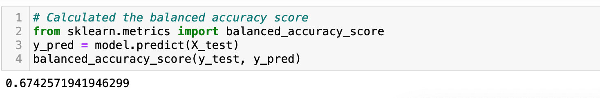

- High risk precision of **1%** with **74%** recall score.
- Low risk precision of **100%** with **61%** recall score.

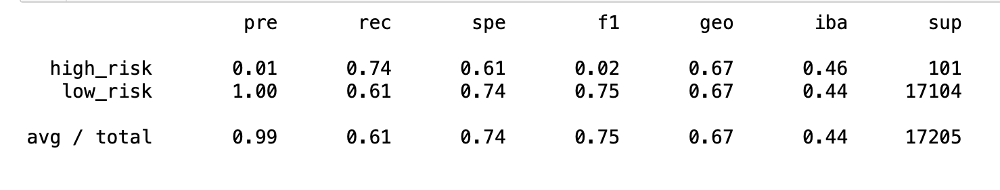

### SMOTE Model

This portion of the report focuses on the results achieved using another oversampling approach, the **Synthetic minority oversampling technique (SMOTE)**, which deals with increasing the size of the minority by interpolating new instances. The results of the SMOTE model are as follows as depicted in the figures below:

- Balanced accuracy score of **66.2%** which is **1.2%** less than the random over sampling model.

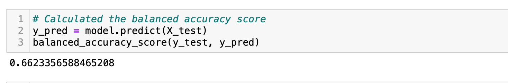

- High risk precision of **1%** with **63%** recall score.
- Low risk precision of **100%** due to high number of true negatives and recall score of **69%**.

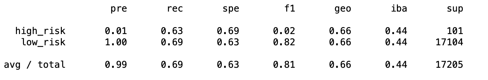

### Cluster Centroids Model

This part of the project focuses on cluster centroids undersampling which is another machine learning model used for predicting credit risk where the majority class is undersampled down to the size of the minority class. The results achieved using this undersampling technique are as follows as depicted in the figures below:

- Balanced accuracy score of **54.4%**.

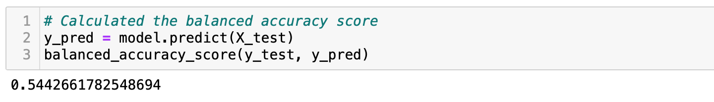

- High risk precision of **1%** with **69%** recall score.
- Low risk precision of **100%** with **40%** recall score.

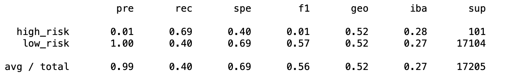

## SMOTEENN Model

In this portion of the project, SMOTEENN  which is considered as an approach to resampling that combines aspects of both oversampling and undersampling  was used for predicting the credit risk. This model oversamples the minority class with SMOTE and cleans the resulting data via undersampling approach. The results achieved using this approach are as follows as demonstrated in the figures below:

- Balanced accuracy score of **66.2%**.

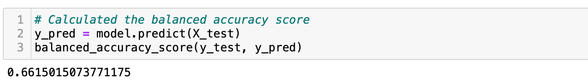

- High risk precision of **1%** with **73%** recall score.
- Low risk precision of **100%** with **59%** recall score.

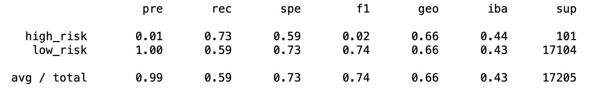

### Balanced Random Forest Classifier Model

In this section of the project the credit risk was predicted using another machine learning model, Balanced Random Forest classifier, that is used for reducing bias. The results achieved from this model are as follows:

- Balanced accuracy score of **78.9%**.

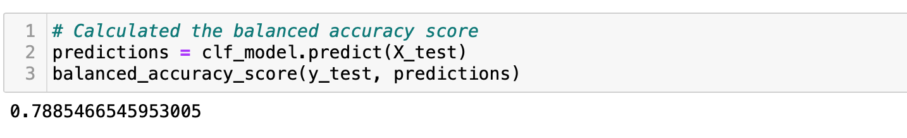

- High risk precision of **3%** with **70%** recall score.
- Low risk precision of **100%** with **87%** recall score.

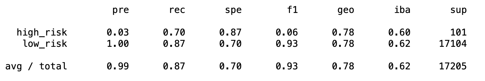

### Easy Ensemble Classifier Model

Lastly, the Easy Ensemble Classifier machine learning model was used for predicting the credit risk. The results achieved from this model are as follow:

- Balanced accuracy score of **93.2%**.

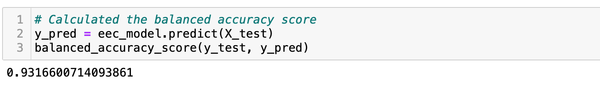

- High risk precision of **9%** with **92%** recall score.
- Low risk precision of **100%** with **94%** recall score.

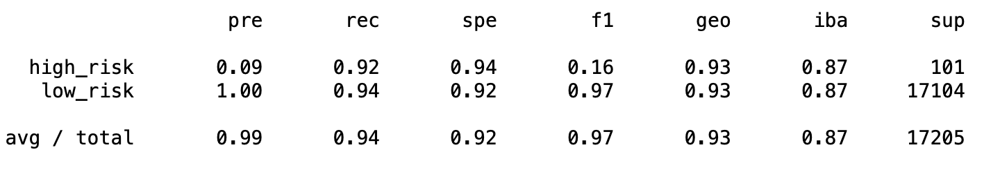

## Summary

In summary, all the six machine learning models in terms of Random Over Sampling, SMOTE, Cluster Centroids, SMOTEENN, Balanced Random Classifier, and Easy Ensemble Classifier models were used for predicting credit risk analysis. Looking at the results achieved, it is evident that the ensemble models outperformed the resampling models especially on the recall scores. Additionally, the Balanced Random Forest Classifier and the Easy Ensemble Classifier models had the highest accuracy scores of **78.9%** and **93.2%** respectively, comparing to the four resampling models. 

The Easy Ensemble Classifier model had the best performance comparing to other models, with a highest recall score of **92%** indicating that this model detects majority of the high credit risks. However, with a low precision of **9%** which is an indicative of large number of false positives, majority of low risk credits were detected as high risk which results in LendingClub company to lose its future customers and revenue by rejecting credit cards of those customers, thus causing those individuals to take their business to other companies. As a result of this, I would not recommended any of the aforementioned models to be used by the LendingClub company for predicting credit risk.

